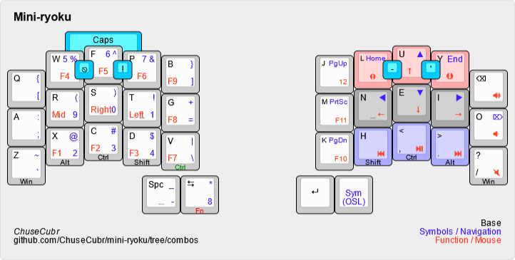
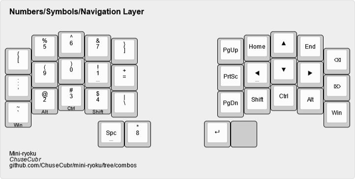

= Mini-ryoku
:toc:
:toc-placement: macro

Mini-ryoku is a compact 34-key adaptation of the https://github.com/manna-harbour/miryoku[Miryoku layout].

See it in action here:

image::https://img.youtube.com/vi/U8XBPkBnx-o/0.jpg[link="https://youtu.be/U8XBPkBnx-o"]

The files in this repo are for the https://github.com/davidphilipbarr/Sweep[Ferris Sweep] to be used in QMK. Unlike the https://github.com/ChuseCubr/mini-ryoku/tree/main[main branch], this isn't available for QMK configurator or Vial (though it's easy to configure yourself).

toc::[]

== Alternate Layouts

Check out the https://github.com/ChuseCubr/mini-ryoku/branches[branches] for alternatives like one with https://github.com/ChuseCubr/mini-ryoku/tree/combos[combos] (which I have since kept as my main).

== About the Layout

I have two main issues with the Miryoku layout for my needs:

It has too many layers.::
I currently use Vial on a bigger keyboard since I like to experiment. This takes up more memory and limits the number of layers I can have. I want to have room for extra layers like gaming layers.
It was made for 36 keys.::
36 keys is already pretty niche, but I wanted to push my limits and see if 34 keys is usable for me.

To fix these, I had to make changes that break the https://github.com/manna-harbour/miryoku/tree/master/docs/reference#general-principles[principles that Miryoku abides by]. If these principles are important to you, this may not be your layout.

This doesn't have all the features Miryoku offers, but it's all that I need. With all the extra space, you could always add your own. For example, I have my own gaming layers.

== Layout

image::images/miniryoku-layers.png[mini-ryoku layers]

=== Bottom Row Mods

One of the biggest changes is the use of bottom row mods instead of home row mods.

* The bottom row is the least used row in Colemak-DH for English.
** This lessens conflicts when typing quickly.
* This allows for combining layers.

*These mod keys are found on every layer.* Should you make changes, I recommend you keep these.

=== Combos

I found 34 keys to be too few, as it made me overuse my thumbs. Since then, I've added my most commonly used keys as combos, as well as layer toggles to prevent thumb overuse.

These combos are available on every layer.

=== Layers

==== Base

image::images/miniryoku-base.png[mini-ryoku base layer]

Like the default Miryoku layout, this uses the Colemak-DH layout with one change: `;` is replaced with `backspace`.

[cols="1,1"]
|===
|Change
|Reason

|`;` is `backspace`
|I use `backspace` very often.

|`backspace` is a num/sym/nav OSL
|Access to the num/sym/nav layer should be quick, and OSL reduces key holds.

|`escape` and `delete` thumb keys are removed.
|To fit on 34 keys.

|`space` is a dedicated key.
|Good for fast typists (I'm relatively quick at around 110 WPM with this layout).

|`enter` is a dedicated key.
|It's too important to accidentally press when attempting to hold.

|`v` is a mod tap for `ctrl`.
|Allows for one-handed copying.
|===

==== Num-Sym-Nav

===== Left Side (Num-Sym)

The general layout is mostly the same, with a numpad and some surrounding symbols. Except...

*What is with that numpad?!* Hear me out.

I optimized the key placement for symbols:

* The most common symbols (8-1) are found at the home row and thumb.
* The rest (2-7) just count up, so they're easily remembered.

Accessing symbols is done by holding the right side `shift` key.

===== Right Side (Nav)

This is where I start to completely deviate from Miryoku. Layers from hereon are completely different and arbitrary, based entirely on my own preferences. Feel free to make changes.

Should you make changes, I recommend keeping the dedicated modifiers for quick access.

[cols="1,1"]
|===
|Design decision
|Reason

|WASD/inverted T arrow keys
|I never got used to Vim-style arrow keys. Keeping a more conventional arrow cluster on the right hand without needing the left hand to access it felt natural to me, coming from a traditional TKL layout

|`home` and `end`
|Like big left/right arrow keys for faster line start/end navigation outside Vim
|===

The rest of the keys I don't use much, but I put them where I felt made sense. This is where I recommend you deviate. For example, you can put layer toggles or extra keys here.

==== Function-Mouse-Media

image::images/miniryoku-function.png[mini-ryoku function layer]

Mouse keys are set up in a similar way to the nav cluster keys.

Mouse buttons have been moved to the left side, as one-handed operation is difficult.

Function keys fill the gaps.

The media keys are also extra keys I don't use much. I recommend that you use these keys if you want to modify this layout.
