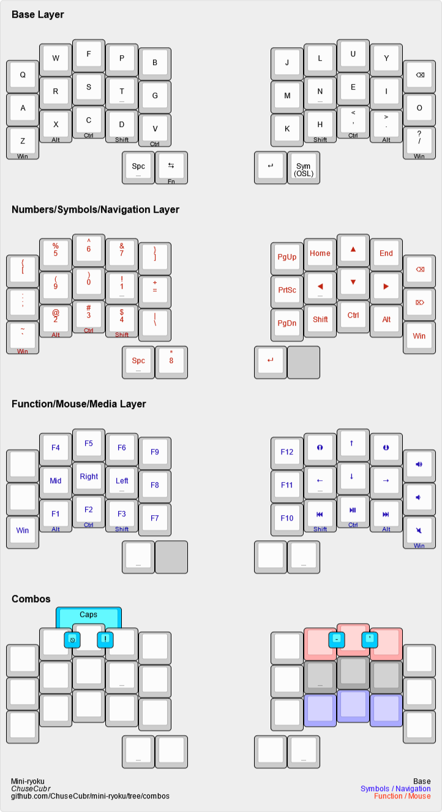
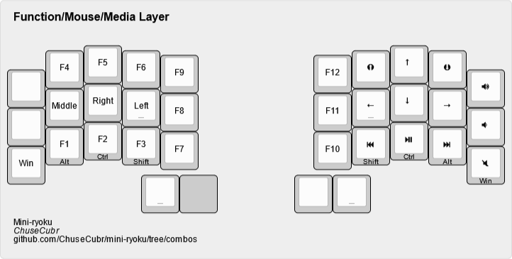

# Mini-ryoku

Mini-ryoku is a compact 34-key adaptation of the [Miryoku layout](https://github.com/manna-harbour/miryoku).

## Table of Contents

- [About the Layout](#about-the-layout)
- [Layout](#layout)
  - [Bottom Row Mods](#bottom-row-mods)
  - [Layers](#layers)
    - [Base](#base)
    - [Num-Sym-Nav](#num-sym-nav)
      - [Left Side](#left-side-num-sym)
      - [Right Side](#right-side-nav)
    - [Function-Mouse-Media](#function-mouse-media)
      - [Left Side](#left-side-function)
      - [Right Side](#right-side-mouse-media)

## About the Layout

I have two main issues with the Miryoku layout for my needs:

1. **It has too many layers.**
    - I currently use Vial on a bigger keyboard since I like to experiment. This takes up more memory and limits the number of layers I can have.
    - I want to have room for extra layers like gaming layers.
2. **It was made for 36 keys.**
    - 36 keys is already pretty niche, but I wanted to push my limits and see if 34 keys is usable for me.

To fix these, I had to make changes that break the [principles that Miryoku abides by](https://github.com/manna-harbour/miryoku/tree/master/docs/reference#general-principles). If these principles are important to you, this may not be your layout.

This also doesn't have all the features Miryoku offers, but it's all that I need.

## Layout

### Bottom Row Mods

One of the biggest changes is the use of bottom row mods instead of home row mods.

- The bottom row is the least used row in Colemak-DH for English.
  - This lessens conflicts when typing quickly.
- This allows for combining layers.

**These mod keys are found on every layer.** Should you make changes, I recommend you keep these.

### Layers

#### Base

Like the default Miryoku layout, this uses the Colemak-DH layout with one change: `;` is replaced with `'`.

|Change|Reason|
|---|---|
|`escape` and `backspace` thumb keys are removed.|To fit on 34 keys.|
|`space` is now a dedicated key.|Good for fast typists (I'm relatively quick at around 110 WPM with this layout).|
|`enter` is now a dedicated key.|It's too important to accidentally press when attempting to hold.|
|`v` is now a mod tap for `ctrl`.|Allows for one-handed copying.|

#### Num-Sym-Nav

##### Left Side (Num-Sym)

The general layout is mostly the same, with a numpad and some surrounding symbols. Except...

*What is with that numpad?!* Hear me out.

|Change|Reason|
|---|---|
|`()!` at home row|I find them to be the most used symbols.|
|`*` at thumb key|Also a common symbol.|
|`-` at home thumb key|Commonly used like `space`.|

Accessing symbols is done by holding the right side `shift` key.

##### Right Side (Nav)

This is where I start to completely deviate from Miryoku. Layers from hereon are completely different and arbitrary, based entirely on my own preferences. Feel free to make changes.

Should you make changes, I recommend keeping the dedicated `shift` key for quick access to symbols on the left half.

#### Function-Mouse-Media

##### Left Side (Function)

I don't use `scroll lock` and `pause break`, so I moved `F10`-`F12` to the right side to make space for `escape`. This allows for left-hand one-handed `escape`.

##### Right Side (Mouse-Media)

Like the nav layer right half, this layer is arbitrary. Feel free to make changes.
